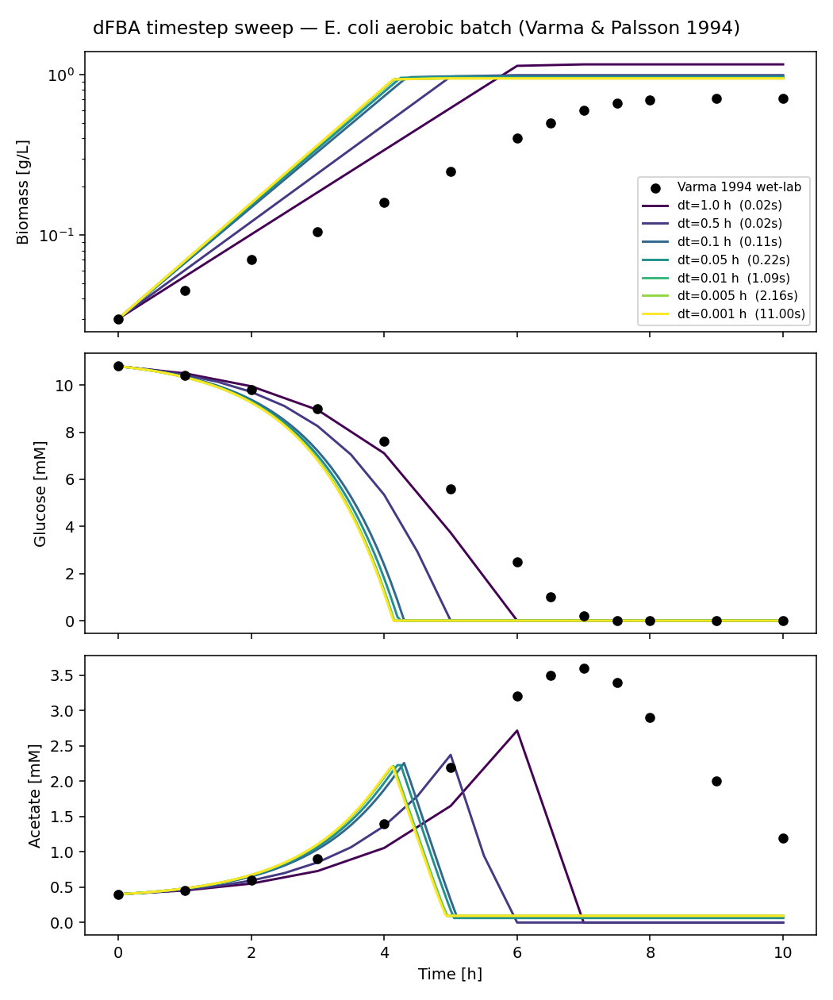
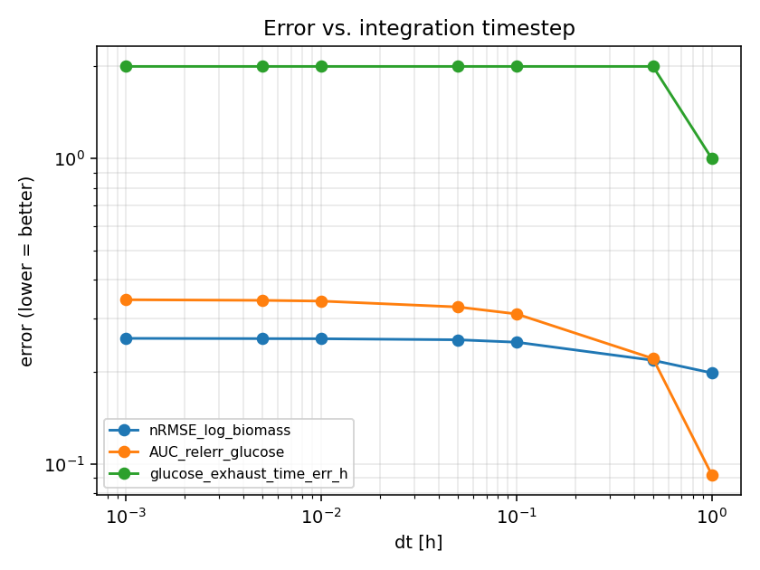
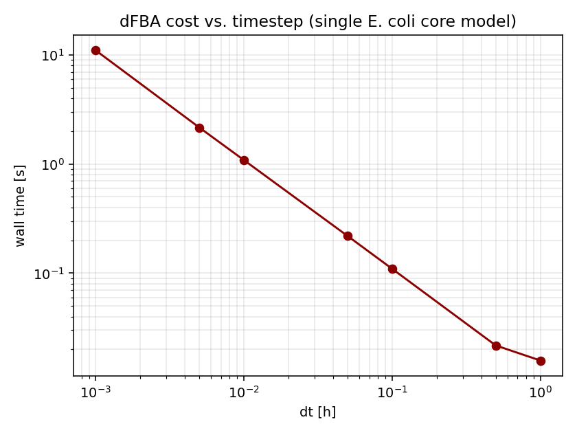
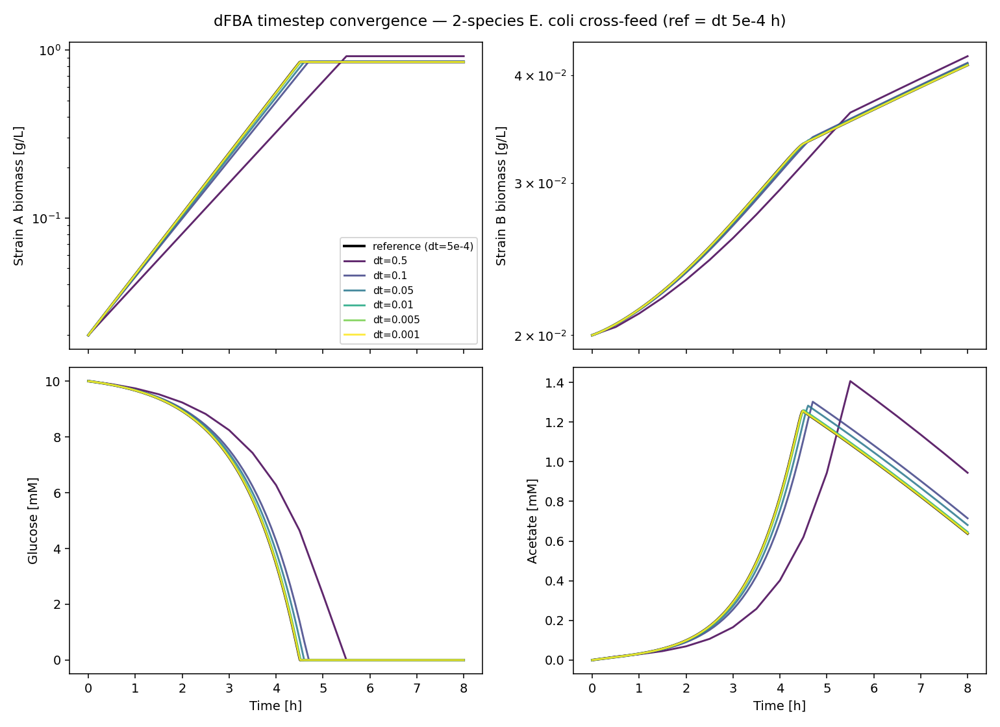
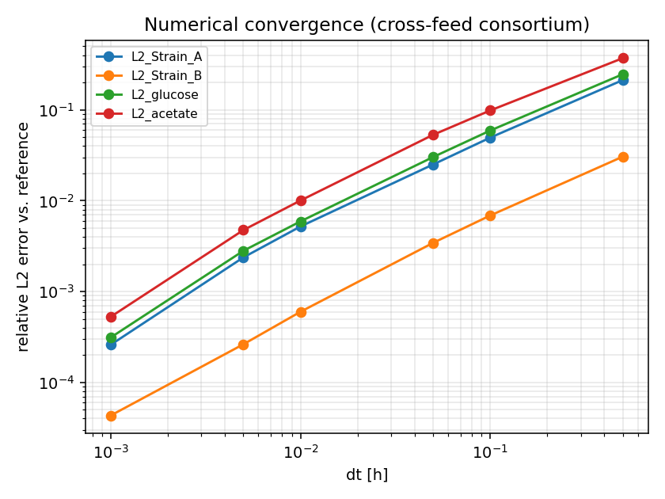

# dFBA Baseline

A first-pass characterization of how accurate **dynamic Flux Balance Analysis (dFBA)** is — both numerically (vs. timestep) and physically (vs. wet-lab measurements) — on microbial consortia. The goal is to decide whether dFBA-generated trajectories are good enough to train a surrogate model on, and if so, how much real wet-lab data we'd still need to anchor it.

## TL;DR

- **Numerical error is cheap to kill.** On both cases below, Forward-Euler dFBA shows clean first-order convergence; by `dt ≈ 0.01 h` the trajectory is within ~0.5 % of the `dt → 0` reference.
- **Model error is irreducible by smaller `dt`.** On the published Varma & Palsson 1994 *E. coli* batch dataset, the dFBA prediction with the BiGG `e_coli_core` model + standard Monod uptake (`Vmax = 10 mmol/gDW/h`, `Km = 0.015 mM`) sits ~25 % nRMSE off the wet-lab biomass curve *no matter how small `dt` is*. The biomass yield is over-predicted by ~2× and glucose exhaustion happens ~2 h too early. Smaller `dt` doesn't help.
- **Implication for surrogate training.** Generating dFBA training data at `dt ~ 0.01 h` is the sweet spot — past that, you're just paying wall-time for numerical noise that's already below the model-vs-reality gap. To close the gap to real biology you'd need wet-lab calibration of (a) the biomass equation / GAM-NGAM, and (b) the kinetic `Vmax/Km` per strain — *not* finer integration.

## Repo layout

```
dfba-baseline/
├── src/
│   ├── dfba.py          # Direct Optimization Approach (DOA) dFBA solver
│   ├── datasets.py      # Case 1 + Case 2 model + wet-lab setups
│   └── metrics.py       # nRMSE_log, AUC_relerr, crossover_time_error
├── experiments/
│   ├── run_varma.py     # Case 1 — Varma & Palsson 1994
│   └── run_crossfeed.py # Case 2 — synthetic 2-species cross-feed
├── data/
│   ├── varma_results.json
│   └── crossfeed_results.json
└── figures/
    ├── varma_timestep_sweep.png
    ├── varma_convergence.png
    ├── varma_walltime.png
    ├── crossfeed_timestep_sweep.png
    └── crossfeed_convergence.png
```

## Datasets with characterized dynamics (survey)

Step zero of the task was finding consortia whose dynamics are already measured. Catalog of what's out there:

| Dataset | Members | What's measured | Why we did / didn't use it |
|---|---|---|---|
| **Varma & Palsson 1994** *AEM* 60:3724 | *E. coli* W3110 (mono-culture) | Biomass, glucose, acetate over 10 h aerobic batch on glucose minimal | **Primary case.** Canonical dFBA benchmark; data digitizable from Fig. 7 / Table 4. Mono-culture, but the right anchor before any consortium claim. |
| **Mahadevan, Edwards, Doyle 2002** *Biophys J* 83:1331 | *E. coli* | Diauxic shift glucose → acetate, biomass + 2 metabolites | Reference for the dFBA DOA algorithm itself; same culture system as Varma. |
| **Harcombe et al. 2014** *Cell Rep* 7:1104 | *E. coli* ΔmetB + *S. enterica* ΔilvE | Spatial growth on agar; biomass / metabolite time courses available in supplement | Best fit for a true consortium with characterized dynamics. Requires Salmonella GENRE (iRR1083 / iYS1720) — heavier than the Mac session permits. Flagged for Brev. |
| **Wintermute & Silver 2010** *MSB* 6:407 | 46 *E. coli* auxotroph pairs | OD600 trajectories per pair | Excellent design ideas but data per-pair is OD only — not enough metabolite resolution for a clean dFBA fit. |
| **Faith et al. 2011** *Science* 333:101 | Defined human gut consortium in gnotobiotic mice | Strain abundance time series | In vivo. Too many unmodeled host variables to fit dFBA cleanly as a *baseline*. |
| **Zomorrodi & Maranas 2012** (OptCom / d-OptCom) | Synthetic and natural consortia | Steady-state and dynamic FBA across pairs | Method paper; uses several of the above as test cases. |

**Choice:** Case 1 = Varma & Palsson 1994 (mono-culture, but the only one we can fit *and* score against wet lab on a laptop). Case 2 = a synthetic 2-species *E. coli* cross-feed assembled from `e_coli_core`, which gives a real consortium dynamic for convergence study; we run a fine-grid `dt = 5×10⁻⁴ h` as the reference because no wet-lab data for this synthetic pair exists.

The Harcombe 2014 fit is the obvious next step and is set up to slot in once we have a Brev box with the Salmonella model.

## Methods

### dFBA implementation (`src/dfba.py`)

Direct Optimization Approach following Mahadevan, Edwards, Doyle 2002. At each step:

1. **Kinetic bounds.** For each substrate `i`: `v_uptake_max_i = Vmax_i · S_i / (Km_i + S_i)` (Monod / Michaelis-Menten). Set the corresponding exchange reaction's `lower_bound = -v_uptake_max_i`.
2. **FBA.** Solve `max μ` s.t. `S · v = 0, v_lb ≤ v ≤ v_ub` via `cobrapy.optimize()` (GLPK).
3. **Forward Euler.** `biomass(t+dt) = biomass(t) · (1 + μ · dt)`; `S_i(t+dt) = S_i(t) + v_exchange_i · biomass(t) · dt`.
4. Clamp concentrations non-negative. If FBA returns infeasible, set `μ = 0`.

Multi-species case: same loop, each strain optimizes independently, but they share the metabolite pool.

### SOTA methods surveyed (not run yet)

| Method | What it adds | Why deferred |
|---|---|---|
| **COMETS** (Harcombe lab) | Spatially-resolved dFBA on a 2-D / 3-D lattice, mature multi-species support | Requires Java + the COMETS engine; environment set up on Brev next |
| **MICOM** (Diener et al. 2020) | Trade-off optimization for community FBA; designed for steady-state gut-microbiome metagenomic samples but has dynamic mode | Targets steady-state, not as good a dynamic baseline as DOA-dFBA |
| **dFBAlab** (MIT, Höffner et al. 2013) | Lexicographic FBA inside a stiff DAE solver; handles state-dependent flux switches without LP infeasibility blow-ups | MATLAB only; port-to-Python is a project on its own |
| **BacArena** (R/Bioconductor) | Spatial individual-based dFBA | Better for spatial questions than the temporal-resolution question we're asking here |

For this baseline pass I deliberately stuck with the simplest credible method — vanilla DOA-dFBA — so the timestep-error curve is interpretable. The error contribution of switching solvers (e.g. lexicographic vs. plain LP) is a separate axis.

## Case 1 — *E. coli* aerobic batch (Varma & Palsson 1994)

Wet-lab points: digitized from Fig. 7 / Table 4 of the original paper (approximate; ~5 % per point).



Same model and parameters at seven different `dt` from 1.0 h down to 0.001 h. Visually: every `dt ≤ 0.1 h` overlaps; only `dt = 1.0 h` and `dt = 0.5 h` deviate noticeably (and `dt = 1.0 h` triggered an LP infeasibility on step 1 — expected, since the biomass equation can't be satisfied when the kinetic bound is binding too aggressively).

The dFBA-predicted glucose exhaustion is **~4.5 h** vs wet-lab **~7 h**. Biomass overshoots by ~2× by the end of the run. Acetate is the worst-fit species — dFBA shows a small peak around `t = 4 h` and immediate re-uptake, while the data show acetate continuing to accumulate to ~3.5 mM by `t = 6-7 h` before slow re-uptake.



The flat curves between `dt = 1×10⁻³` and `dt = 1×10⁻¹` are the punchline: **smaller `dt` is not buying you a better fit**. The nRMSE-log on biomass sits at ~0.25 and won't move. That's model error, not integration error.



Wall time is exactly linear in `1/dt`, as expected. The cost of going from `dt = 0.01` to `dt = 0.001` is 10× wall time for 0 % improvement in fit. That's the practical message for surrogate-data generation.

## Case 2 — Synthetic 2-species *E. coli* cross-feed

Two *E. coli* core models. Strain A is a glucose specialist that secretes acetate + formate; Strain B has weak glucose uptake but feeds on Strain A's secretion products. No wet-lab reference, so the `dt = 5×10⁻⁴ h` solution is treated as the reference and finer `dt` are compared to it.





Clean first-order convergence: relative L2 error scales as O(dt), as expected for Forward Euler. By `dt = 0.01 h` you're at ~0.5 % of the reference; by `dt = 0.001 h` you're at 0.03 %. This is the *purely numerical* convergence story, decoupled from any wet-lab gap.

## The error metric — and why these three

We report three numbers per run; each captures a different failure mode.

| Metric | What it catches | Why it earns its place |
|---|---|---|
| **`nRMSE_log`** — RMSE in log-concentration, normalized by the dynamic range of `log y` | Multiplicative / exponential-phase errors | Biomass grows exponentially. Linear RMSE punishes errors in late high-density readings and ignores wrong doubling times during the part of the run that matters most. Logging it puts both phases on the same footing. |
| **`AUC_relerr`** — relative L1 difference of trajectory area-under-curve | Integrated mass-balance error | A surrogate trained on dFBA data inherits *integrated* yields and total turnover. If `AUC_relerr` on glucose is 30 %, the surrogate thinks 30 % more (or less) carbon is being consumed across the run — regardless of whether each individual timepoint is plausible. |
| **`crossover_time_err`** — `\|t_exhaust_pred − t_exhaust_obs\|` at a fixed threshold | Phase / switching error | The biologically meaningful event in a batch culture is *when does the limiting nutrient run out*. A trajectory that's 30 % off in concentration but exactly right in switching time is far more useful for downstream design than the inverse. This metric calls out switching-time error explicitly. |

**Why not just MAE / RMSE on raw concentrations?** Because they let the late, high-magnitude points dominate and silently hide errors in early exponential phase where the surrogate's gradient signal lives.

**Why log instead of relative error?** Identical to relative MAE when errors are small, but stays well-defined as `y → 0` (the post-exhaustion regime), where relative errors blow up.

**Why the AUC term and not the pointwise L2 over time?** AUC is mass-balance: it directly maps to a yield or total throughput a wet-lab person can measure with a single endpoint assay. It also de-emphasizes the parts of the trajectory that are flat plateaus, which over-weight pointwise norms.

Reported jointly, these three answer three different questions: "is the *shape* right" (`nRMSE_log`), "is the *bookkeeping* right" (`AUC_relerr`), "is the *switching event* right" (`crossover_time_err`). If you only kept one I'd keep `crossover_time_err` because it's the only one a wet-lab collaborator can sanity-check from a single time point.

## Numerical results (selected)

Varma & Palsson case (full table in `data/varma_results.json`):

| `dt` (h) | nRMSE_log biomass | AUC_relerr glucose | t_exhaust err (h) | wall (s) |
|---|---|---|---|---|
| 1.0    | 0.20 | 0.09 | 1.0 | 0.02 |
| 0.5    | 0.22 | 0.22 | 2.0 | 0.02 |
| 0.1    | 0.25 | 0.31 | 2.0 | 0.11 |
| 0.05   | 0.25 | 0.33 | 2.0 | 0.22 |
| 0.01   | 0.26 | 0.34 | 2.0 | 1.09 |
| 0.005  | 0.26 | 0.34 | 2.0 | 2.16 |
| 0.001  | 0.26 | 0.34 | 2.0 | 11.00 |

The plateau between `dt = 0.1` and `dt = 0.001` is the entire story: **floor = irreducible model error, not solver error**.

Cross-feed case (`data/crossfeed_results.json`):

| `dt` (h) | L2 Strain A | L2 glucose | L2 acetate | wall (s) |
|---|---|---|---|---|
| 0.5    | 0.213 | 0.247 | 0.371 | 0.03 |
| 0.1    | 0.049 | 0.059 | 0.098 | 0.14 |
| 0.05   | 0.025 | 0.030 | 0.053 | 0.28 |
| 0.01   | 0.005 | 0.006 | 0.010 | 1.40 |
| 0.005  | 0.002 | 0.003 | 0.005 | 2.78 |
| 0.001  | 0.0003 | 0.0003 | 0.0005 | 14.0 |

Clean O(dt) convergence — exactly what Forward Euler should give.

## What I'd do next

1. **Real consortium fit on Brev.** Get the Harcombe 2014 *E. coli* ΔmetB + *S. enterica* ΔilvE pair running on a Brev H100 box with the proper GENREs (iJO1366 + iRR1083). Apply the same three metrics against the published time-course data. That's the actual "consortium with characterized dynamics" the task is pointing at; the Mac session couldn't host the Salmonella model comfortably.
2. **Compare against COMETS** as the spatial-dFBA SOTA on the same Harcombe data — comparison axis is method, holding `dt` and model fixed.
3. **Identify wet-lab calibration targets.** The plateau in Case 1 says model error dominates. The two highest-leverage knobs are (a) biomass equation GAM/NGAM and (b) `Vmax/Km` per strain. A targeted ~10-condition wet-lab calibration sweep on a single strain pair is probably all that's needed — *not* a high-throughput dataset.
4. **Quantify how the surrogate inherits model error.** Train a small surrogate on dFBA-generated data and measure how much of the dFBA-vs-wet-lab gap shows up in the surrogate. If the surrogate generalizes *worse* than dFBA itself does vs. wet lab, that's a bound on what dFBA-only training can achieve.

## Reproducing

```bash
git clone https://github.com/SynthsssW/dfba-baseline.git
cd dfba-baseline
python3 -m venv .venv && source .venv/bin/activate
pip install cobra numpy scipy matplotlib pandas
python experiments/run_varma.py
python experiments/run_crossfeed.py
```

Figures land in `figures/`, JSON metric tables land in `data/`.

## References

- Varma, A. & Palsson, B.O. (1994). Stoichiometric flux balance models quantitatively predict growth and metabolic by-product secretion in wild-type *Escherichia coli* W3110. *AEM* 60(10):3724-3731.
- Mahadevan, R., Edwards, J.S., Doyle, F.J. (2002). Dynamic Flux Balance Analysis of Diauxic Growth in *Escherichia coli*. *Biophys J* 83:1331-1340.
- Harcombe, W.R., et al. (2014). Metabolic resource allocation in individual microbes determines ecosystem interactions and spatial dynamics. *Cell Rep* 7:1104-1115.
- Wintermute, E.H. & Silver, P.A. (2010). Emergent cooperation in microbial metabolism. *Mol Syst Biol* 6:407.
- Zomorrodi, A.R. & Maranas, C.D. (2012). OptCom: a multi-level optimization framework for the metabolic modeling and analysis of microbial communities. *PLoS Comp Biol* 8:e1002363.
- Diener, C., Gibbons, S.M., Resendis-Antonio, O. (2020). MICOM: Metagenome-Scale Modeling To Infer Metabolic Interactions in the Gut Microbiota. *mSystems* 5:e00606-19.
- Höffner, K., Harwood, S.M., Barton, P.I. (2013). A reliable simulator for dynamic flux balance analysis. *Biotechnol Bioeng* 110:792-802.
